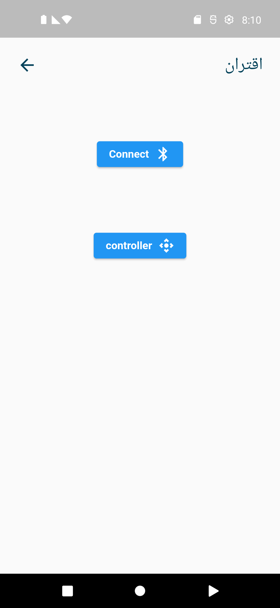
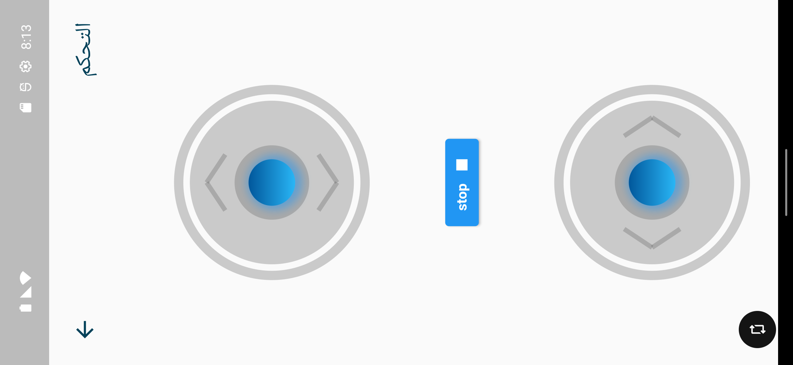
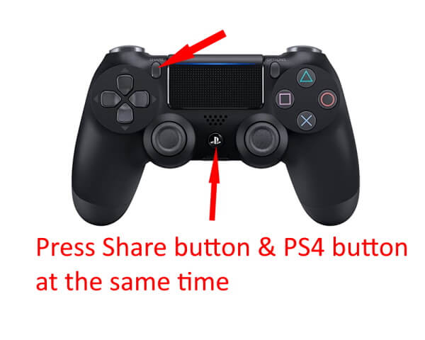

# Follow Me Carry-on Cart

## Control by application

### Getting Started

1- Install the Python library:

```bash
sudo pip install bluedot
```

2- connect raspberry pi with your phone

3- run this code

```python
from bluedot.btcomm import BluetoothServer
from signal import pause
from control import Control

pwmValue = 0

Control1 = Control(23, 24, 14, 15, 5, 6, 17, 27)
value_move = 0
value_dirction = 0
def data_received(data):
    print(data)
    try:
        if(data == '0'):
            Control1.move_forward(0)
        if(data[0] == '1' and len(data) > 3):
            if(float(data[1:]) < 0):
                print("back")
                value_move = abs(float(data[1:])) * 100
                print(value_move)
                Control1.move_bakcward(value_move)
            elif(float(data[1:]) > 0):
                print("forward")
                value_move = float(data[1:]) * 100
                print(value_move)
                Control1.move_forward(value_move)
        if(data[0] == '2' and len(data) > 3):
            if(float(data[1:]) < 0):
                print("left")
                value_dirction = abs(float(data[1:])) * 100
                print(value_dirction)
                Control1.left(value_dirction)
            elif(float(data[1:]) > 0):
                print("right")
                value_dirction = abs(float(data[1:])) * 100
                print(value_dirction)
                Control1.right(value_dirction)


        # print(data[1:])
    except ValueError:
        Control1.move_forward(0)
        print('error')


s = BluetoothServer(data_received)
pause()
```

4- open the application



5- press on connect button

6- Wait a few moments

7- press on conroller button



## Control by PS4 controller

### Getting Started

1- Install the Python library:

```bash
sudo pip install pyPS4Controller
```

2- commands

```bash
py3ps4c init
sudo ds4drv
```

3- press SHARE + PS4



4- run this code

```python
from pyPS4Controller.controller import Controller
from control import Control

pwmValue = 0

Control1 = Control(23, 24, 14, 15, 5, 6, 17, 27)


class MyController(Controller):

    def __init__(self, **kwargs):
        Controller.__init__(self, **kwargs)
    # move forward

    def on_R3_down(self, value):
        pwmValue = int(50 + ((value / 32767) * 50))
        Control1.move_forward(pwmValue)
        print("on_R3_down: {}".format(value))

    def on_R3_up(self, value):
        pwmValue = int(((value / 32767) * 50) + 50)
        Control1.move_forward(pwmValue)
        print("on_R3_up: {}".format(value))

    # move backword

    def on_R3_right(self, value):
        pwmValue = int(50 + ((value / 32767) * 50))
        Control1.move_bakcward(pwmValue)
        print("on_R3_right: {}".format(value))

    def on_R3_left(self, value):
        pwmValue = int(((value / 32767) * 50) + 50)
        Control1.move_bakcward(pwmValue)
        print("on_R3_left: {}".format(value))
    # move right

    def on_R1_press(self):
        Control1.right(100)

    def on_R1_release(self):
        Control1.stop()
    # move left

    def on_L1_press(self):
        Control1.left(100)

    def on_L1_release(self):
        Control1.stop()


controller = MyController(interface="/dev/input/js0",
                          connecting_using_ds4drv=False)
controller.listen(timeout=60)

```
## Control by Aruco Code

### Getting Started
1- control by aruco code
```command
run Control_By_ArucoCode.py
```
2- control by aruco code and distance
```command
run Control_With_Distance.py
```
3- control by aruco code ,distance and ultrasoinc
```command
run dis_and_ultra.py
```
